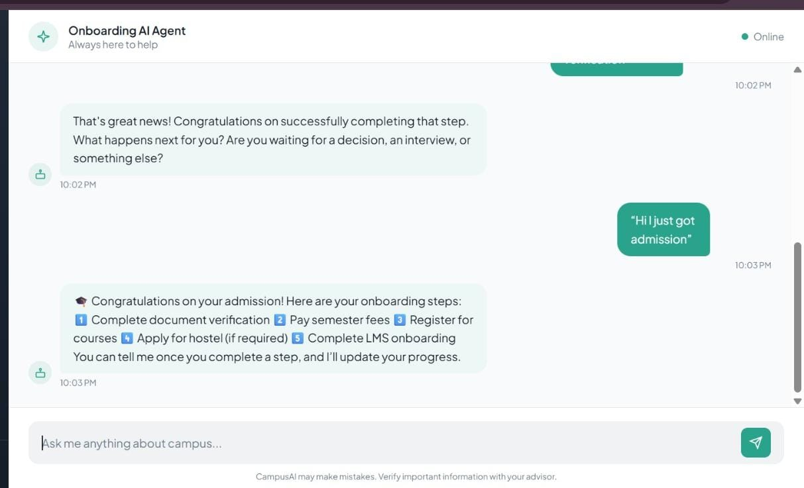
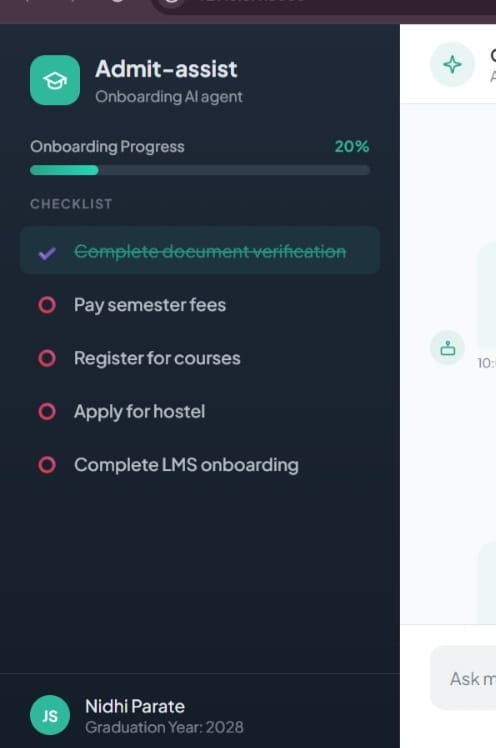

# Admit-Assist

## Smart Student Onboarding Agent for Engineering Colleges

Admit-Assist is an intelligent onboarding assistant designed to guide newly admitted engineering students through the complete onboarding lifecycle.
It reduces confusion, prevents missed deadlines, and improves administrative efficiency by combining rule-based onboarding tracking with Retrieval-Augmented Generation (RAG) powered AI responses.

## Problem Statement

### Engineering colleges manage a complex onboarding lifecycle:

- Document verification
- Fee payment
- Course registration
- Hostel allocation
- LMS onboarding

### Students face:
- Fragmented portals
- Static PDFs
- Missed deadlines
- Administrative overload
- Lack of personalized guidance

Admit-Assist transforms onboarding into a guided, intelligent experience.

## Solution Overview
### Admit-Assist is a lifecycle-aware AI onboarding agent that:
- Tracks onboarding progress
- Provides personalized step-by-step guidance
- Retrieves grounded answers from official documents
- Shows explainable AI responses
- Updates progress dynamically
  
It is not just a chatbot ; it is a structured onboarding companion

## Core Features

- Personalized onboarding checklist
- Real-time progress tracking
- Rule-based onboarding updates
- RAG-based intelligent FAQ
- Source transparency ("Official Admission Brochure")
- Responsible AI safeguards

## System Architecture

    User (Frontend UI)
          ↓
    Flask Backend
          ↓
    Onboarding Status Tracker
          ↓
    RAG Retrieval Layer
          ↓
    Admission Brochure (Text File)
          ↓
    Gemini API

## Flow
- User sends query
- Backend checks onboarding rules
- If knowledge query → RAG triggered
- Relevant brochure content injected into prompt
- Gemini generates grounded answer
- Response returned with optional source tag

## Retrieval-Augmented Generation (RAG)
### When a user asks a knowledge-based question (e.g., fee deadline):
- The system detects keywords
- Loads admission brochure content
- Injects brochure context into the prompt
- Forces the model to use only official information
- Returns answer with source attribution
  
This reduces hallucination and improves reliability.

## Responsible AI Implementation
### Admit-Assist follows responsible AI principles:
- Data Transparency – Uses only official brochure data
- Explainability – Displays source for RAG answers
- Bias Avoidance – No demographic inference
- Human-in-the-loop – Critical decisions not automated
- Limited Data Storage – Minimal persistence

## Tech Stack

    Frontend
      - HTML
      - CSS
      - Vanilla JavaScript
    Backend
      - Python
      - Flask
    AI Layer
      - Gemini 2.5 Flash API
    Retrieval
      - Keyword-based context filtering
      - Text file ingestion
    Database
      - SQLite (Optional / Extendable)

## Demo Flow

1️) User: “Hi I got admission”

→ Checklist displayed

2️) User: “I completed document verification”

→ Progress updated

3️) User: “When is fee payment deadline?”

→ RAG response with source

4️) Dashboard shows onboarding completion percentage

## Team 
- Mrudul Narkhede – Backend & AI Integration
- Nidhi Parate  – Frontend & UX

## 📸 Demo Screenshots

### Chat Interface

### RAG Answer Example

### Progress Tracker

Second Year Btech IT student at UMIT.

## Conclusion

Admit-Assist reframes onboarding from a passive information system into an intelligent, responsible, and student-centered support system.
It demonstrates how AI can improve educational access while maintaining transparency and accountability.
