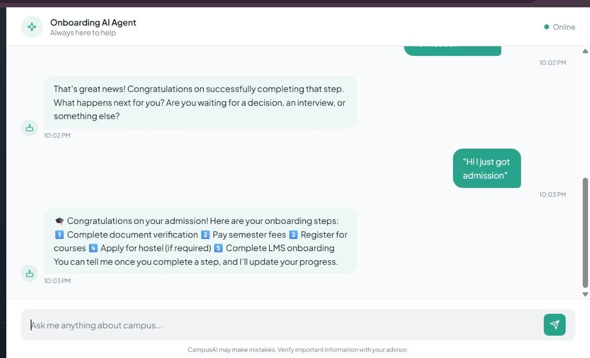
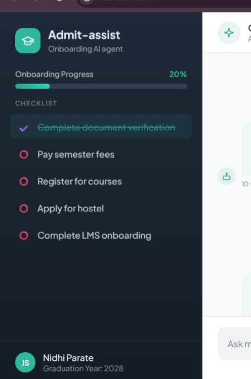

# Admit-Assist

## Smart Student Onboarding Agent for Engineering Colleges

Admit-Assist is an intelligent onboarding assistant designed to guide newly admitted engineering students through the complete onboarding lifecycle.
It reduces confusion, prevents missed deadlines, and improves administrative efficiency by combining a deterministic onboarding state machine with cutting-edge **Vector-Search RAG** (Retrieval-Augmented Generation) powered by fully-local SentenceTransformers and Groq's high-speed inference.


## Problem Statement

### Engineering colleges manage a complex onboarding lifecycle:
- Document verification
- Fee payment
- Course registration
- Hostel allocation
- LMS onboarding

### Students face:
- Fragmented portals
- Static PDFs
- Missed deadlines
- Administrative overload
- Lack of personalized guidance

Admit-Assist transforms onboarding into a guided, intelligent, and deeply responsive SaaS-style experience.


## Solution Overview
### Admit-Assist is a production-grade AI onboarding agent that:
- Securely tracks onboarding progress per student using JSON Web Tokens (JWT).
- Retrieves highly accurate, grounded answers from official documents via FAISS Semantic Vector Search.
- Delivers explainable AI responses seamlessly attached to localized source documents.
- Features a beautifully engineered React (Vite) User Interface replicating enterprise-grade glassmorphism (Stripe/Linear aesthetics).


## Tech Stack (Production Ready)

**Frontend (React UI)**
- React.js (Vite)
- Custom Vanilla CSS (Advanced animations & mesh gradients)
- Fetch API for proxying

**Backend Framework & Auth**
- Flask (Python)
- Flask-SQLAlchemy (ORM mapping)
- Flask-JWT-Extended (Secure stateless authentication)

**AI & Vector Search System**
- Meta FAISS (Facebook AI Similarity Search)
- `sentence-transformers` (`all-MiniLM-L6-v2`) for fully decoupled local embeddings.
- Groq Cloud API (`llama-3.1-8b-instant`) for ultra-fast, high-precision LLM Orchestration

**DevOps & Infrastructure**
- Docker & Docker Compose (Multi-container architecture)
- SQLite / PostgreSQL (Database Abstraction Layer)
- GitHub Actions (CI/CD Automated Pipelines)


## System Architecture

```text
    [ React (Vite) Client ]  <-- JWT Protected -->  [ Flask REST API ]
            |                                               |
        User Query                                  Check Onboarding Auth
            |                                               ↓
    [ Vector Retrieval Layer ]                      [ SQLite/PostgreSQL DB ]
    - Local Embedding via all-MiniLM-L6-v2           - SQLAlchemy ORM
    - L2 Distance FAISS Vector Search                - Dynamic Status Flags
            |
    [ Top-K Context Injection ]
            ↓
    [ Groq Llama-3.1-8b Answer ]
```


## Core Features

### 1. Vector-Search RAG
Unlike naive keyword matchers, Admit-Assist chunks the underlying `admission_brochure.txt`, converts paragraphs into 384-dimensional mathematical arrays using completely local models (`sentence-transformers`), and stores them in a persistent **FAISS** index. When a user asks a question, the prompt is embedded on the server, retrieving the closest vector distances before sending the structured prompt to Groq's insanely fast LLMs, avoiding vendor lock-in.

### 2. Multi-Tenant JWT Authentication
Using hashed credentials (Werkzeug) and `Flask-JWT-Extended`, students securely access private, decentralized onboarding checklists that reliably persist their specific status via PostgreSQL. 

### 3. CI/CD & Docker Orchestration
The application is pre-containerized utilizing a customized Dockerfile. Using `docker-compose.yml`, local FAISS chunks, Flask, and the database server orchestrate a complete ecosystem with zero-friction onboarding for new developers. Automatic GitHub Action runners validate code upon every main branch push.


## Demo Flow

1️) **User:** “Hi I got admission”
→ Custom React UI renders interactive checklist.

2️) **User:** “I completed document verification”
→ Progress bar visually spikes, ORM database commits boolean `true`.

3️) **User:** “When is fee payment deadline?”
→ Query embedded -> FAISS returns Top-3 Contexts -> RAG Response generated with source attribution.

4️) **Dashboard:** React hook state mutates displaying an onboarding completion percentage loop.


## Team 
- **Mrudul Narkhede** – Backend & AI Integration
- **Nidhi Parate**  – Frontend, UX, React Architecture


## 📸 Demo Screenshots

*(Note: Add updated React Dashboard Screenshots here)*

### Chat Interface


### Progress Tracker



## Conclusion

Admit-Assist reframes onboarding from a passive information system into an intelligent, responsible, and student-centered support application. By structuring the codebase into modern industry norms (React, Docker, Vector DBs, ORMs), it stands as a robust standard of Applied AI Engineering.
